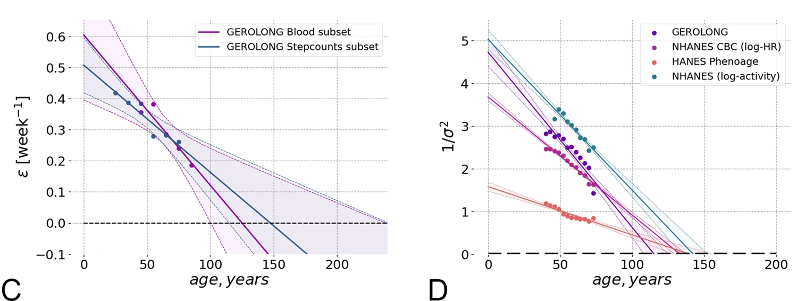
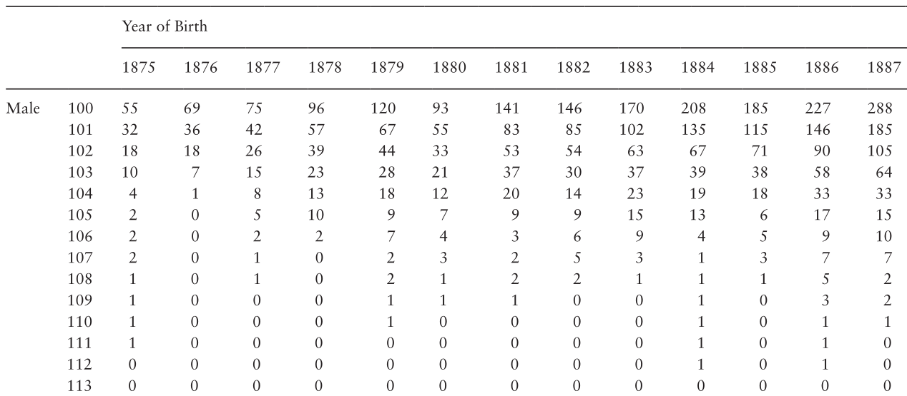
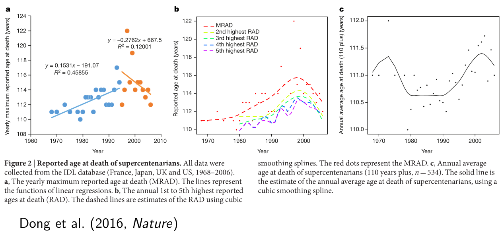

```{r setup, include=FALSE}
knitr::opts_chunk$set(warning = FALSE, message = FALSE,
                      fig.retina = 3, fig.align = "center")
```

```{r packages-data, include=FALSE}
library(tidyverse)
xaringanExtra::use_xaringan_extra(c("tile_view", "webcam"))

```

layout: false
background-image: url("figures/logo_hec_montreal_blanc_web.png")
background-size: 400px
background-position: 5% 5%


class: center middle main-title section-title-1

# Is there a limit to human longevity?

.class-info[

**Department of Mathematics and Statistics, Dalhousie University**

.light[Léo Belzile, HEC Montréal]
<br>
Based on joint work with Anthony Davison, Jutta Gampe, Holger Rootzén, Dmitrii Zholud
]


---

layout: true
class: title title-1

---

# Estimating human lifespan

The study of human longevity is full of pitfalls for the unwarry...

The problem raises several statistical problems revolving around

.box-1.medium.sp-after-half[data quality]
.box-2.medium.sp-after-half[models]
.box-3.medium.sp-after-half[extrapolation]

---

# Glossary

- .color-1[**Supercentenarian**]: person living beyond 110th birthday
- .color-1[**Semi-supercentenarian**]: dies between 105th and 110th birthdays.
- .color-1[**Lifetime**]: life-length of an individual.
- .color-1[**Lifespan**]: upper limit (if any) on distribution of lifetimes.


---

# Why study longevity?


Statistical analysis needed to assess biological theories about

.box-inv-1.sp-after[natural selection]

.box-inv-1.sp-after[mortality plateau]

.box-inv-1.sp-after[existence of<br> finite lifespan]

--

.box-1.medium[Lots of interest in the news!]
---

# Exponential growth of mortality

.small[

> *It is believed that exponential growth of mortality with age (Gompertz law) is followed by a period of deceleration, with slower rates of mortality increase at older ages.*

> *Recent studies found that the exponential increase of the mortality risk with age (the famous Gompertz law) continues even at extreme old ages in humans, rats, and mice, thus challenging traditional views about old-age mortality deceleration, mortality leveling-off, and late-life mortality plateaus.* 

]

.small[
Gavrilova & Gavrilov (2015), *Journals of Gerontology: Biological Sciences*
]
???

The Gompertz–Makeham model is extremely popular in demography and fits well the distribution of lifetimes at lower levels, until 102-105.

---

# Theory of senescence

```{r}
#| eval: true
#| echo: false
#| out.width: '100%'
#| fig.cap: "Figure 3 of Pyrkov et al. (2021), Nature Communications, doi:10.1038/s41467-021-23014-1."

```

???

In Japan, in 2016, 8167 male and 57 525 female were centenarian.
- rate of 5.1 per 10K in 2015

In Canada, 6116 female and 835 male
- rate of 1.9 per 10K

Between 1983 and 2009, a total of 
- 12 supercentenarians died
- 321 semisupercentenarians died
in Quebec.

- oldest living today: Soeur André (Lucile Randon, 118 years, 236 days);
– oldest ever: Jeanne Calment (122 years, 164 days).

---


layout: false
name: data
class: center middle section-title section-title-1 

.huge[Data quality]

---

layout: true
class: title title-1

---

# Sampling 

Information limited due to availability of historical records.

- Validation is key
   - necronyms
   - record falsification
   - mistakes in data registers

- Most databases (e.g., *Gerontology Research Group*) include self-reported records.

--

.box-inv-1.medium[**Opportunity samples**]

???

Shigechio Izumi was excluded from records because he beared his dead brother name, so died age 105 rather than 120.

In Japan, the first modern family registration system was established in 1872 (Jinshin-KOSEKI), amended in 1886 by the Family Registration Law, Chapter 10 of Exceptional Lifespan.

Italy: example of teenager reportedly borned in 1800s, who died age 13 but was initially recorded to have died 113.

---

# Jeanne Calment, the controversy

```{r}
#| eval: true
#| echo: false
#| out.width: '80%'
#| fig.align: center

```


???

Nikolai Zak (conspiracy?) theory in Rejuvenation Research that Yvonne Calment took the place of her mother Jeanne to avoid inheritance taxes.
---

# International Database on Longevity

To draw reliable conclusions, we need .color-1[**representative samples**].

- .section-title-1[**validated supercentenarian (110+)**]  from 13 countries

--

- plus (partly validated) .section-title-1[** semi-supercentenarian (105-109)**] for 9 countries

--

- Age-ascertainement bias-free

--

.box-inv-1[1081 validated supercentenarians]

???

- Nearly 50% of the records fail the validation check.
- Random sample validated for semi-supercentenarians in France


---

# Sampling mechanisms

Data are obtained by .section-title-1[**casting a net**] on the population of potential (semi)-supercentenarians.

--

- for IDL, (only) supercentenarians in a country .color-1[**who died**] between dates $c_1$ and $c_2$.

--

- records for the candidates are then individually validated.

---

# Lexis diagram for interval truncation

```{r lexisdiag, echo = FALSE, fig.cap = "Lexis diagrams showing the selection mechanism.", out.width ='82%'}
magick::image_read_pdf("figures/lexis_selection.pdf", page = 1)
```

---

# More complex truncation schemes!

Semisupercentenarians (105-109) who died in window $(d_1, d_2)\neq (c_1, c_2)$.


```{r lexisdiag3, echo = FALSE, fig.cap = "Lexis diagrams for IDL data with semisupercentenarian and supercentenarians", out.width ='85%'}
magick::image_read_pdf("figures/Lexisdiag2.pdf", page = 1)
```

---

# Lexis diagram for Italian data


```{r lexisdiag2, echo = FALSE, fig.cap = "Lexis diagrams for Istat data with semisupercentenarian and supercentenarians", out.width ='45%'}
magick::image_read_pdf("figures/Lexis.pdf", page = 1)
```


---

# Truncation can be hidden

- .section-title-1[ **Extinct cohort method** ]: Birth cohorts for which no death has been reported for X consecutive years.
- counts cross-tabulated by years of birth, age and gender.

```{r countdata, echo = FALSE, out.width ='56%', fig.cap = "Annual Vital Statistics Report of Japan (Hanamaya & Sibuya, 2014)."}

```

---

# Why does it matter?

.small[

Ignoring truncation leads to  .section-title-1[**underestimation**] of the survival probability: population increase and reduction in mortality at lower age translates into larger impact for later birth cohorts.

]

```{r artefacts_truncation, echo = FALSE, fig.cap = "Impact of truncation on quantile-quantile plots (left) and maximum age by birth year (right).", out.width ='65%'}
magick::image_read_pdf("figures/truncation_artefacts.pdf", page = 1)
```

---

# Incorrect conclusions

```{r Dong, echo = FALSE, fig.cap = "Failing to account for truncation and increase in population.", out.width ='85%'}

```

---

layout: false
name: models
class: center middle section-title section-title-2

.huge[Models]

---

layout: true
class: title title-2

---

# Survival analysis

Denote the lifetime $T$, a continuous random variable with distribution $F$, density $f$, lifespan $t_{F}= \sup\{t: F(t) < 1\}$ and survivor and hazard functions

$$\begin{align*}
 S(t) &= \Pr(T>t) =1-F(t), 
\\h(t) &= \frac{f(t)}{S(t)}, \quad t>0.
\end{align*}$$

---

# Poisson process

- Suppose individuals independently reach age $u_0$ at calendar time $x$ at rate $\nu(x)$, and subsequently die at age $t+u_0$ with density $f$.
- Events in $\mathcal{C} = [c_1 , c_2] \times [u_0, \infty)$ follow a Poisson process of rate
$$\begin{align*}
\lambda(c, t) = \nu(c − t)f(t), \qquad
c \in \mathbb{R}, t > 0
\end{align*}$$
at calendar time $c$ and excess lifetime $t$.

---

# Poisson process

- The lifetime density for dying in $\mathcal{C}$ is
$$\begin{align*}
f_{\mathcal{C}}(t) \propto f(t)w_{\mathcal{C}}(t), \quad w_{\mathcal{C}}(t) = \int_{c_1 - t}^{c_2-t} \nu(x) \mathrm{d}x, \quad t>0
\end{align*}$$
where $w_{\mathcal{C}}$ is decreasing, so $f_{\mathcal{C}}$ is .color-2[**stochastically smaller**] than $f$.


---

# Likelihood contributions

The likelihood depends on $\nu$, hence consider the conditional likelihood
$$\begin{align*}
\frac{f(t)}{F(b)-F(a)}, \quad a < t< b
\end{align*}$$
for interval truncated data and, for left-truncated and right-censored data,
$$\begin{align*}
\frac{h(t)^\delta S(t)}{1-F(a)}, \quad t> a,
\end{align*}$$
where $[a, b] = [\max\{0, c_1 − x\}, c_2 − x]$.

---

# Models

Many models popular in demography, many with infinite endpoint.

- exponential: $h(t) = \sigma^{-1}$ for $\sigma>0$.
- Gompertz–Makeham (1825, 1860): $$h(t) = \lambda + \sigma^{-1}\exp(\beta t/\sigma), \qquad \beta, \sigma>0, \lambda \geq 0.$$
- Logistic (Thatcher, 1999): 
$$h(t) = \lambda + \frac{A\exp(\beta t/ \sigma)}{1+B\exp(\beta t/ \sigma)}, \qquad A>0, B \ge 0.$$

---

# Generalized Pareto distribution

Most records include only lifetime above $u_0$ (.color-2[**threshold exceedances**])

If a scaling function $a_u$ exists such
that $(X − u)/a_u$ has a non-degenerate distribution conditional on $X > u$, then (Pickands, 1975)
$$\frac{\Pr\{(X-u)/a_u > t\}}{\Pr(X >u)} \to 
\begin{cases}
(1+\xi t/\sigma)_{+}^{-1/\xi}, & \xi \neq 0\\
\exp(-t/\sigma), & \xi = 0.
\end{cases}$$
where $c_+ = \max\{c, 0\}$ for a real number $c$.

The .color-2[**unique nondegenerate**] limiting distribution for exceedances of a threshold $u$ is .section-title-2[**generalized Pareto**].

---

# Penultimate approximation


At lower levels, the behaviour of the fitted model depends on the reciprocal hazard, $r(t) = 1/h(t)$; under mild regularity conditions,

$$\xi = \lim_{t \to t_{F}} r'(t)$$
and a pre-asymptotic shape is $\xi_u = r'(u)$.

.small[
For example, the Gompertz model has $\xi_u \nearrow 0$: estimates of $\xi$ tend to be negative.
]

???

The speed of convergence is quite fast, so we would expect the exceedances to be well approximated by an exponential distribution.

---

# Threshold stability

A key property of the generalized Pareto distribution is **threshold stability**.

- can extrapolate behaviour of $F$ at higher levels
- useful for choosing $u$ in applications
   - fit model at multiple threshold $u_1 < \cdots < u_k$.
   - check whether shape $\xi$ agrees over range.

---


# Lack of (threshold) stability


```{r thstab, echo = FALSE, fig.cap = "Threshold stability plots for France and Italy (left), and Netherlands (right).", out.width ='60%'}
magick::image_read_pdf("figures/threshold_stability3.pdf", page = 1)
```

---

# How good is the approximation?


```{r qqplot_italian, echo = FALSE, fig.cap = "Quantile-quantile plots with 95% pointwise and simultaneous bands (left) and conditional cumulative hazard (right) for Istat.", out.width ='75%'}
magick::image_read_pdf("figures/italian_fit.pdf", page = 1)
```

???

Bootstrap estimates obtained by conditioning on truncation time and birth dates. New observations simulated from doubly truncated distributions

---

# Accounting for interval truncation


The plotting position for $x$-axis of Q-Q plot for observation $y_i$ is
$$
F_0^{-1}\left[F_0(a_i) +\left\\{ F_0(b_i)-F_0(a_i) \right\\} \frac{F_n(y_i) - F_n(a_i)}{F_n(b_i)-F_n(a_i)}\right]
$$
where
- $F_0$ is the postulated (i.e., fitted) parametric distribution,
- $F_0^{-1}$ is the corresponding quantile function,
- $F_n$ is the NPMLE of the distribution function (Turnbull, 1976).

Censored observations not displayed.

---
# Flexibility is key

We fit a semiparametric hazard function $$h(t) = \{\sigma + \xi t + g(t)\}^{-1}_{+}$$ with $g(t) \to 0$ as $t \to t_{F}$ with $g(t)$ a cubic regression spline
- generalizes generalized Pareto model
- reduces to parametric model in upper tail
- equispaced knots

???

Left: figure obtained with bshazard for left-truncated right-censored data
Right: discretize data into daily bins, use cumulative hazard H(t) = sum_{z=1}^t h(z)/365 for interpretability, so survival function is exp(-H(x))
---
# Let the tail speak for itself!


```{r splines_italian, echo = FALSE, fig.cap = "Nonparametric hazard (left) and semiparametric generalized Pareto (right).", out.width ='75%'}
magick::image_read_pdf("figures/italcent_hazard.pdf", page = 1)
```

.tiny[Semiparametric estimator suggest a wide range of plausible behaviour, including constant risk.]
---

# Take home messages


.box-inv-2.sp-after[cannot use low thresholds<br> for extrapolation.]

--

.box-inv-2.sp-after[goodness-of-fit diagnostics suggest<br> generalized Pareto model fits well.]

--

.box-inv-2.sp-after[hazard doesn't stabilize<br>until about 108 years.]

--

.box-inv-2.sp-after[shape estimates suggest<br>a **decrease** of the risk above.]

---
# Is there a finite lifespan?

Mathematically speaking, is $t_F=\sup\{t: F(t)<1\} = \infty$?


Hard to convey to the average reader:
- $t_F=\infty$ does not imply immortality.
- $\Pr(T > u) < \varepsilon$ does not imply finite lifespan $t_F < u$.


--

.box-inv-2[the answer may be in the model.]


- Gompertz–Makeham has no right endpoint  and $t_F =\infty$.
- exponential model has a constant hazard (.color-2[**plateau of mortality**]).
- the generalized Pareto implies a lifespan of $u-\sigma/\xi$ if $\xi < 0$.

---


layout: false
name: extrapolation
class: center middle section-title section-title-3

.huge.color-0[Extrapolation]

---

layout: true
class: title title-3

---

# Is the lifetime distribution bounded?


```{r profile_lifetime, echo = FALSE, fig.cap = "Profile likelihood for endpoint for various countries and three thresholds.", out.width ='55%'}
magick::image_read_pdf("figures/profile_endpt.pdf", page = 1)
```

---

# Human lifespan

No discernible differences between

- earlier and later birth cohorts,
- countries,
- men and women, except that after age 108 French men have lower survival.

Not to be confused with gender inbalance due to lower survival of men.
---

# You have no power in here!

The power of a likelihood ratio test for detecting a finite endpoint (obtained by simulating records with a generalized Pareto distribution with lifespan $t_F$) is high: based on France/Italy/IDL data (2016 version),

- 125 years: combined power of 97%;
- 130 years: combined power of 83%;
- 135 years: combined power of 66%.

Suggests that the human lifespan lies well beyond any lifetime yet observed.

---


# Huge uncertainty

Japanese (unvalidated) data are interval-censored and right-truncated

```{r japanese, echo = FALSE, fig.cap = "Posterior credible intervals by threshold (left) and sampling distribution with(out) rounding (right).", out.width ='65%'}
magick::image_read_pdf("figures/02-japanese_bayesian.pdf", page = 1)
```

---

# Supercentenarians [don't] live forever...

Estimated exponential distribution above 110 years for IDL has mean 0.5 (0.46, 0.53): a coin toss.

--

Surviving until 130 years conditional on surviving until 110 years
- is equivalent to obtaining 20 heads in a row,
- a less than one-in-a-million chance...

--

Anticipated increase in number of supercentenarians make it possible to observe 130, but higher record is highly unlikely (Pearce & Raftery 2021).

---

# References

- Léo R. Belzile, Anthony C. Davison, Jutta Gampe, Holger Rootzén and Dmitrii Zholud (2022). Is there a cap on longevity? A statistical review., Annual Reviews of Statistics and its Applications, 9, 21–45, [`doi:10.1146/annurev-statistics-040120-025426`](https://doi.org/10.1146/annurev-statistics-040120-025426).
- Léo R. Belzile and Anthony C. Davison (2020). Improved inference for risk measures of univariate extremes (2022), Annals of Applied Statistics, 16(3): 1524–1549, [`doi: 10.1214/21-AOAS1555`](https://doi.org/10.1214/21-AOAS1555)
- Léo R. Belzile, Anthony C. Davison, Holger Rootzén and Dmitrii Zholud (2021). Human mortality at extreme age., Royal Society Open Science, 8, [`doi:10.1098/rsos.202097`](https://doi.org/10.1098/rsos.202097).

